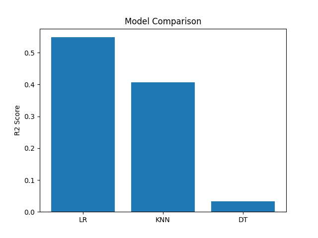
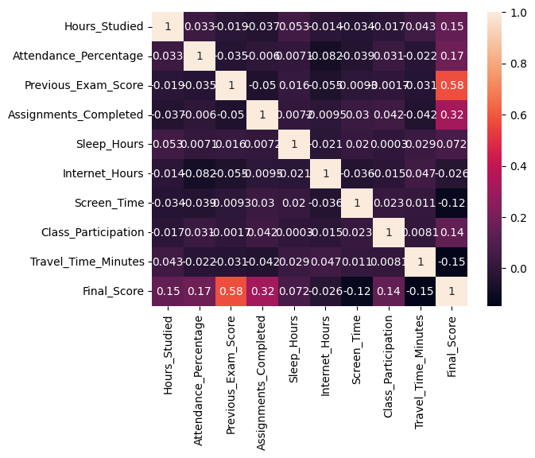
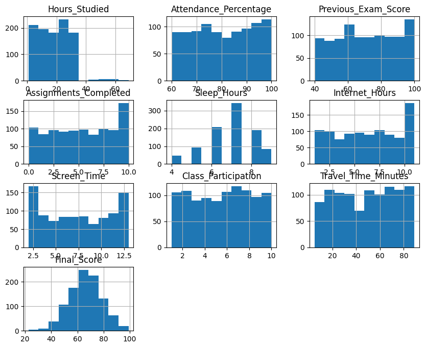

# Student-Exam-Score-Predictor-

Built an end-to-end ML pipeline to predict student exam scores using Linear Regression, KNN, and Decision Tree Regression, achieving model comparison through MAE, MSE, and R² metrics.

## Project Overview

The Student Exam Score Predictor is a Machine Learning project that predicts a student's final exam score based on academic, behavioral, and lifestyle factors.

The project follows a complete Machine Learning workflow including:

* Data preprocessing
* Missing value handling
* Feature engineering
* Model training
* Model comparison
* Performance evaluation
* Model deployment using Pickle
* Interactive prediction application

---

## Features

Predict student final exam scores

Data preprocessing and cleaning

Missing value treatment

Model comparison

Data visualization

Performance evaluation using R² Score

Model serialization using Pickle

Interactive prediction system

---

## Tech Stack

* Python
* Pandas
* NumPy
* Matplotlib
* Scikit-Learn
* Jupyter Notebook

---

## Dataset Features

The model uses the following features:

| Feature               | Description                         |
| --------------------- | ----------------------------------- |
| Hours_Studied         | Daily study hours                   |
| Attendance_Percentage | Student attendance percentage       |
| Previous_Exam_Score   | Previous examination score          |
| Assignments_Completed | Number of assignments completed     |
| Internet_Hours        | Daily internet usage                |
| Screen_Time           | Daily screen time                   |
| Class_Participation   | Participation level in class        |
| Travel_Time_Minutes   | Daily travel time                   |
| Part_Time_Job         | Whether student has a part-time job |

### Target Variable

```text
Final_Score
```

---

## Machine Learning Models Used

### 1. Linear Regression

A regression algorithm that models the relationship between independent variables and the target variable using a linear equation.

### 2. K-Nearest Neighbors (KNN)

Predicts values based on the nearest training examples in the feature space.

### 3. Decision Tree Regressor

Creates a tree structure to make predictions by learning decision rules from the data.

---

## Model Performance

| Model                   | R² Score |
| ----------------------- | -------- |
| Linear Regression       | 0.548    |
| KNN Regressor           | 0.407    |
| Decision Tree Regressor | 0.046    |

### Best Model

Linear Regression achieved the highest R² Score and was selected as the final model for deployment.

---

## Project Structure

```text
Student-Exam-Score-Predictor/
│
├── Data_Set/
│   └── student_performance_data1.csv
│
├── Model/
│   ├── trained_model.pkl
│   └── Scaler.pkl
│
├── notebooks/
│   └── EDA.ipynb
│
├── screenshots/
│   ├── correlation_heatmap.png
│   ├── prediction_graph.png
│   └── model_comparison.png
│
├── Train.py
├── App.py
├── requirements.txt
└── README.md
```

---

## Project Screenshots

### Model Comparison



### Correlation Heatmap



### Actual vs Predicted



---

## ⚙️ Installation

Clone the repository:

```bash
git clone https://github.com/Krish-Jha-15/Student-Exam-Score-Predictor-.git
```

Move into the project directory:

```bash
cd Student-Exam-Score-Predictor-
```

Install dependencies:

```bash
pip install -r requirements.txt
```

---

## ▶️ Run the Project

### Train the Model

```bash
python Train.py
```

This will:

* Train multiple ML models
* Compare their performance
* Save the best model
* Save the scaler

### Run Prediction Application

```bash
python App.py
```

Enter the required inputs and the model will predict the student's final score.

---

## Evaluation Metrics

The project uses:

* R² Score
* Mean Absolute Error (MAE)
* Mean Squared Error (MSE)

to evaluate model performance.

---

## Future Improvements

* Hyperparameter tuning
* Cross-validation
* Feature selection
* Streamlit web application
* Model deployment on cloud platforms
* Advanced ensemble methods

---

## 👨‍💻 Author

**Krish Jha**

Machine Learning & AI Enthusiast

GitHub: https://github.com/Krish-Jha-15

---

##  If you found this project useful, consider giving it a star on GitHub!
